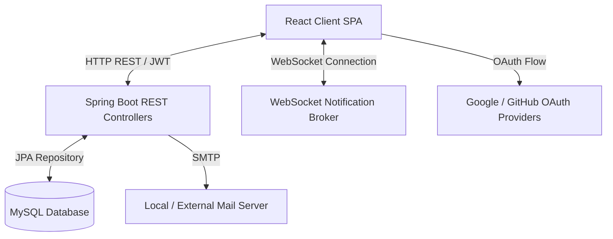

# SEAL — Multi-Round Hackathon Management System

An end-to-end, enterprise-grade Hackathon Management Platform designed to streamline the lifecycle of multi-round technology competitions. The system features a responsive, role-based workspace for Students, Judges, and Coordinators, powered by a secure Spring Boot REST API and a modern React client.

---

## Key Technical Features

### Real-Time WebSocket Synchronization
*   **Decoupled Push Messaging**: Implemented low-overhead native WebSockets on the backend to broadcast real-time notifications to active user sessions.
*   **Instant UI Rehydration**: Integrated standard WebSocket handlers on the React frontend to update global notification states and toast indicators dynamically without page reloads.

### Secure Authentication & Multi-Provider OAuth Linker
*   **JWT Security Filter Pipeline**: Configured stateless authorization filters in Spring Security to protect REST endpoints while permitting public resources and WebSocket handshakes.
*   **Identity Sync Manager**: Built a custom UI and backend synchronization pipeline allowing users to securely link/unlink Google and GitHub OAuth profiles, supporting automatic account merging.

### Enterprise Database Integrity & Constraint Sanity
*   **Automated Schema Triggers**: Developed complex MySQL triggers (`BEFORE INSERT/UPDATE`) to enforce strict tournament integrity, such as preventing conflict of interest (users cannot judge a track they are mentoring) and preventing round design violations.
*   **Mock Hash Auto-Correction**: Configured startup SQL tasks to automatically correct legacy or corrupted database credentials, maintaining continuous service uptime for local test instances.

### Database Binary Storage Engine
*   **Secure Document Vault**: Configured `LONGBLOB` storage in MySQL for user verification files (student cards).
*   **Dual-Layer Fallback Display**: Implemented a fallback rendering system in the React UI that retrieves images from Cloudinary and automatically falls back to secure database byte-streams upon transmission failures.

### Transactional Email Workflows
*   **SMTP Service Integration**: Injected Spring `JavaMailSender` for immediate automated communication on crucial events:
    *   Coordinator registration approval/rejection.
    *   Automatic generation and secure dispatch of temporary credentials for external guest judges.

---

## 🛠️ Technology Stack

| Layer | Technologies |
| :--- | :--- |
| **Backend** | Java 21, Spring Boot 3, Spring Security (JWT), Spring WebSockets, Spring Mail, Hibernate JPA |
| **Database** | MySQL 8.0, custom relational schema, transactional triggers |
| **Frontend** | React 18, Vite, Ant Design, Axios Client, Tailwind CSS / Vanilla CSS |
| **Integrations**| Google OAuth 2.0, GitHub OAuth, SMTP |

---

## Architecture Overview

The system uses a clean client-server architecture:



### Roles & Access Matrix:
*   **Student Workspace**: Onboarding profile completion, student card upload, team creation, member invitation, and round submission tracking.
*   **Judge Workspace**: Real-time evaluation panels, score submission according to criteria, and live dashboard metrics.
*   **Coordinator Workspace**: Global dashboard, registration approval dashboard, temporary judge account generation, and hackathon setup (rounds, tracks, scoring criteria).

---

## Local Installation & Setup

### Prerequisites
*   Java Development Kit (JDK) 21
*   Node.js (v18+) & npm
*   MySQL Server 8.0+

### 1. Database Setup
1. Create a database named `sealhackathon` in your local MySQL instance.
2. The schema and initial seed data will automatically load from `be/src/main/resources/schema.sql` on backend startup.

### 2. Backend Configuration
Configure your local database credentials and JWT/OAuth secrets in `be/src/main/resources/application.properties`:
```properties
spring.datasource.url=jdbc:mysql://localhost:3306/sealhackathon
spring.datasource.username=YOUR_MYSQL_USER
spring.datasource.password=YOUR_MYSQL_PASSWORD

jwt.secret=YOUR_JWT_SECRET_KEY
```

Build and run the Spring Boot application:
```bash
cd be
mvn spring-boot:run
```

### 3. Frontend Configuration
Set up your environment variables in `fe/.env`:
```env
VITE_API_BASE_URL=http://localhost:8080
VITE_CLOUDINARY_CLOUD_NAME=YOUR_CLOUDINARY_NAME
VITE_CLOUDINARY_API_KEY=YOUR_CLOUDINARY_KEY
VITE_CLOUDINARY_API_SECRET=YOUR_CLOUDINARY_SECRET
```

Install dependencies and start the Vite dev server:
```bash
cd fe
npm install
npm run dev
```

Open [http://localhost:5173](http://localhost:5173) in your browser.

---

## Mock Accounts for Testing
Log in with the password `password` for any of the following accounts:
*   **Coordinator**: `coord@fpt.edu.vn`
*   **Internal Judge**: `judge1@fpt.edu.vn`
*   **Student Leader**: `teama@fpt.edu.vn`
